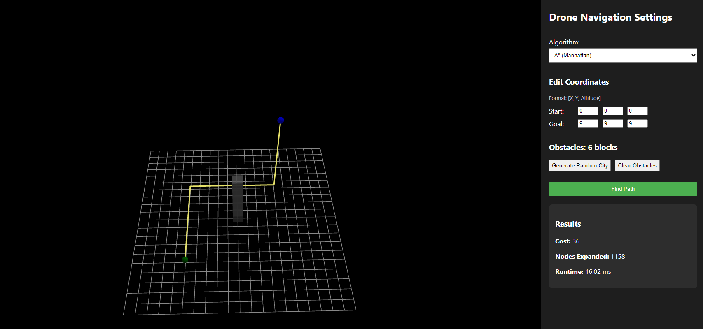
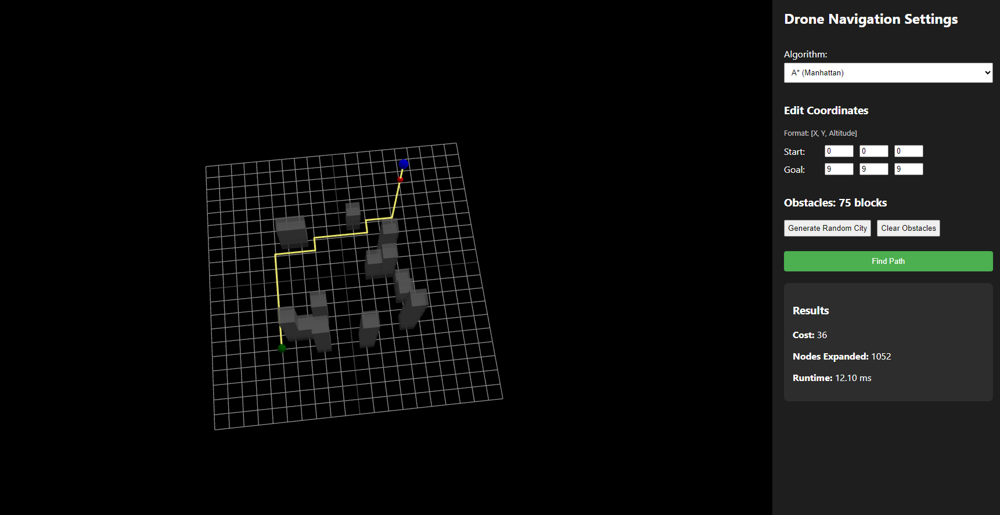
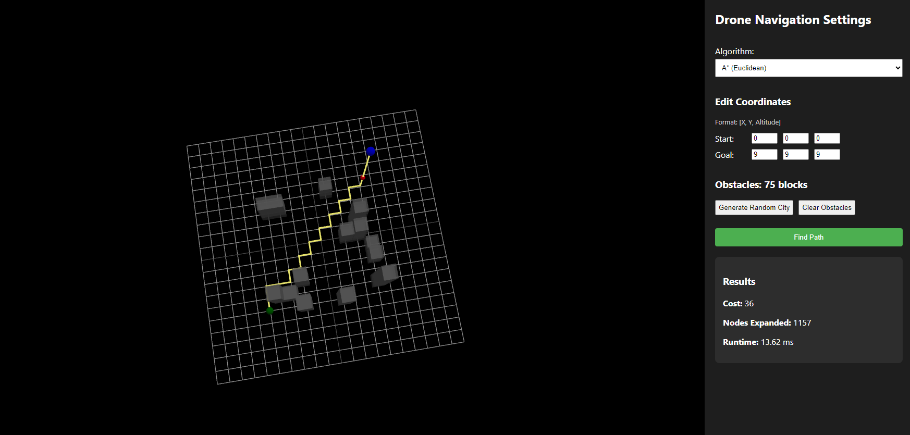

# Progress Report 2

## Project Title
AI-Based Autonomous Drone Navigation in a Simulated 3D Urban Environment

## Course
COMP 569 Artificial Intelligence

## Introduction

In this progress report, I summarize the implementation progress I have made on my drone navigation project, the current behavior of the prototype, the main challenges I have encountered, and the remaining work before the final submission.

Based on your feedback on Progress Report 1, I narrowed the project scope and removed the workforce scheduling portion completely. I decided to focus only on the autonomous drone navigation problem because it is more manageable, more technically coherent, and better aligned with the informed search component of the course. This change also pushed me to think more clearly about how I wanted to simulate the drone environment. My current approach is to simulate the navigation problem as a 3D urban grid in the backend and use a 3D frontend to visualize the environment and animate the path returned by the search algorithm.

At this point, I would describe the system as a working prototype rather than a finished project. The main search pipeline is implemented and testable, but some parts of the heuristic design, benchmarking, and UI refinement are still in progress.

## 1. Implementation Overview

### 1.1 My Current Approach to the Problem

My approach to the problem statement is to model drone navigation as a 3D state-space search problem where the drone must move from a start coordinate to a goal coordinate while avoiding obstacles and minimizing energy cost.

Instead of treating this as a simple shortest-path problem, I designed the environment so that vertical movement is more expensive than horizontal movement. This allows the search algorithms to reflect a more realistic energy tradeoff. In the current prototype:

- horizontal movement costs `1`
- downward movement costs `1`
- upward movement costs `2`

I chose this approach because it makes the pathfinding task more meaningful. The drone is not only trying to reach the goal, but also trying to avoid unnecessary climbing. This gives me a stronger basis for comparing Uniform Cost Search and A* in a way that connects to the course material on informed search and heuristic guidance.

### 1.2 How I Am Simulating the Drone Environment

To answer the simulation question directly, I am currently simulating the drone environment in two connected layers:

1. In the backend, I represent the world as a bounded 3D grid where each state is a coordinate `s = (x, y, z)`.
2. In the frontend, I render that grid as a 3D scene using React and Three.js so that the path can be visualized and animated.

This means the simulation is not just conceptual. The backend computes valid paths through the environment, and the frontend displays the environment, obstacles, path line, and drone movement. Earlier, I had considered using Unity, but in practice I implemented the visualizer with React and `react-three-fiber` because it was easier to connect directly to the FastAPI backend and iterate on during development.

### 1.3 Current Implementation Status

The table below summarizes what is currently implemented and what still needs more work:

| Module | Current Status | Notes |
| --- | --- | --- |
| Search engine | Implemented | UCS and A* run on the 3D grid |
| Cost model | Implemented | Upward movement is penalized more heavily |
| Heuristics | Partially validated | Manhattan and Euclidean are stable so far; building-aware still needs correction |
| FastAPI backend | Implemented | `/pathfind` endpoint returns path and metrics |
| Frontend visualizer | Prototype implemented | Shows grid, obstacles, path, and drone animation |
| Random obstacle generation | Implemented | Available from the UI |
| No-fly zone support | Partially implemented | Backend supports it, but frontend editing is limited |
| Benchmarking | In progress | Small tests completed, broader evaluation still needed |
| Final presentation quality | In progress | Screenshots are included in this version, but broader figure polish still needs work |

### 1.4 Programming Languages and Tools Used

The project currently uses:

- Python for the AI search logic and backend
- FastAPI for the API layer
- Pydantic for request/response modeling
- React and TypeScript for the frontend
- Vite for frontend tooling
- Three.js with `@react-three/fiber` and `@react-three/drei` for 3D rendering
- Axios for communication between frontend and backend

### 1.5 What the Current Prototype Can Do

At the moment, the prototype can already perform the following workflow:

1. Define a 3D grid environment.
2. Set start and goal coordinates.
3. Add obstacles and pass no-fly-zone data to the backend.
4. Choose UCS or one of the A* variants.
5. Request a path from the FastAPI backend.
6. Display the returned path, cost, nodes expanded, and runtime.
7. Animate the drone along the returned path in the 3D view.

This is an important milestone for me because it means the project is no longer only at the design stage. I now have a complete end-to-end prototype that I can use for further testing and improvement.

## 2. Algorithm Implementation

### 2.1 State-Space Representation

I modeled the navigation problem as a state-space search problem in a bounded 3D grid. Each state is represented as:

`s = (x, y, z)`

where:

- `x` and `y` represent horizontal position
- `z` represents altitude

The environment takes the following inputs:

- grid bounds
- start coordinate
- goal coordinate
- obstacle locations
- no-fly-zone locations

In the current implementation, both obstacles and no-fly zones are treated as impassable cells. This makes the environment straightforward to reason about and allows the search algorithm to focus on valid movement through the state space.

### 2.2 Transition and Cost Model

The drone can currently move to neighboring states in six local directions:

- `+x`
- `-x`
- `+y`
- `-y`
- `+z`
- `-z`

The cost model in the backend is asymmetric:

- horizontal movement = `1`
- downward movement = `1`
- upward movement = `2`

This design choice is one of the central ideas in my project. I wanted the search problem to reflect the idea that climbing consumes more energy than moving horizontally or descending. Because of that, the algorithms must search for routes that are both feasible and energy-efficient.

### 2.3 Uniform Cost Search

I implemented Uniform Cost Search as the baseline algorithm. The current version uses a priority queue and expands states in order of increasing path cost `g(n)`. Since all movement costs are non-negative, UCS gives me a reliable optimal baseline.

I am using UCS for two reasons:

- to confirm that the search engine is producing correct low-cost solutions
- to compare its search effort against A*

The backend tracks:

- the returned path
- the total cost
- the number of expanded nodes
- the runtime

These values are useful because they let me compare algorithms in a measurable way instead of only describing them theoretically.

### 2.4 A* Search

I also implemented A* using the same environment and search structure, but with the evaluation function:

`f(n) = g(n) + h(n)`

So far, I have implemented three heuristics:

#### Manhattan Heuristic

`h(n) = |x - x_g| + |y - y_g| + |z - z_g|`

This is currently the most dependable heuristic in my project. It is simple, efficient, and in my tests it consistently reduces node expansions compared with UCS.

#### Euclidean Heuristic

`h(n) = sqrt((x - x_g)^2 + (y - y_g)^2 + (z - z_g)^2)`

This heuristic also works in the current prototype and generally improves over UCS, although in the small benchmark set it does not always outperform Manhattan.

#### Building-Aware Heuristic

`h(n) = d_xy + max(0, h_obs - z)`

I included this heuristic because I wanted the search to account for obstacle height in a more environment-aware way. Conceptually, I still think this is a useful direction, because urban navigation should be influenced by building structure and not only by straight-line distance. However, during testing I found that the current formula is not always admissible, so I am treating it as an experimental heuristic for now rather than a finalized one.

### 2.5 API Integration

The backend exposes a `POST /pathfind` endpoint. It accepts:

- bounds
- start
- goal
- obstacles
- no-fly zones
- selected algorithm

and returns:

- path
- total cost
- nodes expanded
- runtime

This API layer is important in my overall approach because it connects the search engine directly to the frontend simulation. Without it, I would only have a backend algorithm. With it, I now have a usable prototype that demonstrates both the AI logic and the environment visualization together.

### 2.6 Deviations From My Earlier Plan

Compared with my earlier project idea, two important changes happened:

1. I removed workforce scheduling entirely.
2. I used React and Three.js for the simulation layer instead of Unity.

I do not see these as negative changes. In fact, they helped make the project more focused and more feasible. The simulation requirement is still addressed, but the implementation path is now more realistic for the remaining time I have.

## 3. Preliminary Results

### 3.1 What I Have Verified So Far

At this stage, I would describe my results as preliminary rather than final. I have completed several useful checks, but I have not yet finished the larger evaluation I want for the final report.

So far, I have verified the prototype through:

- direct Python runs of the search engine
- a FastAPI smoke test of the `/pathfind` endpoint
- a production build check for the frontend
- repeated small benchmark runs on selected hand-built environments

These checks gave me enough confidence that the system is functioning correctly at a prototype level.

### 3.2 Example Prototype Output

One environment I tested used:

- bounds: `(10, 10, 10)`
- start: `(0, 0, 0)`
- goal: `(9, 9, 9)`
- obstacles: one building column at `(5, 5, z)` for `z = 0..5`
- no-fly zones: none

For that case, the backend returned:

- HTTP status: `200`
- valid path: yes
- path cost: `36`
- nodes expanded with A* Manhattan: `1158`
- path length: `28` coordinates

This was a useful test for me because the resulting path showed that the search could avoid the building column and still reach a high-altitude goal. Figure 1 shows the corresponding frontend output for this scenario.

### 3.3 Preliminary Benchmark Comparison

To start comparing UCS and A*, I ran a small benchmark set on three different environment types. These are not my final experiments, but they already help me understand how the algorithms behave.

#### Scenario A: Open Grid

- bounds: `(8, 8, 6)`
- start: `(0, 0, 0)`
- goal: `(7, 7, 4)`
- obstacles: none

| Algorithm | Mean Cost | Mean Nodes Expanded | Mean Runtime (ms) |
| --- | ---: | ---: | ---: |
| UCS | 22.0 | 530.0 | 13.704 |
| A* Manhattan | 22.0 | 368.0 | 6.950 |
| A* Euclidean | 22.0 | 405.0 | 13.053 |
| A* Building-Aware | 22.0 | 386.0 | 9.807 |

My current interpretation:

- all methods found the same optimal cost
- A* Manhattan clearly reduced node expansions
- even in a simple environment, heuristic guidance is already helpful

#### Scenario B: Single Building Column

- bounds: `(10, 10, 10)`
- start: `(0, 0, 0)`
- goal: `(9, 9, 9)`
- obstacles: one building column at `(5, 5, z)` for `z = 0..5`

| Algorithm | Mean Cost | Mean Nodes Expanded | Mean Runtime (ms) |
| --- | ---: | ---: | ---: |
| UCS | 36.0 | 1309.0 | 33.487 |
| A* Manhattan | 36.0 | 1158.0 | 30.433 |
| A* Euclidean | 36.0 | 1224.0 | 33.415 |
| A* Building-Aware | 36.0 | 1180.0 | 26.721 |

My current interpretation:

- the system is handling obstacles correctly in this test
- A* still improves over UCS, but the gap is smaller than in the open grid
- the high-altitude goal makes this scenario more expensive overall

#### Scenario C: Dense Urban Blocks

- bounds: `(10, 10, 8)`
- start: `(0, 0, 0)`
- goal: `(9, 9, 5)`
- obstacles: several multi-cell building blocks
- no-fly zones: one restricted vertical strip

| Algorithm | Mean Cost | Mean Nodes Expanded | Mean Runtime (ms) |
| --- | ---: | ---: | ---: |
| UCS | 28.0 | 981.0 | 19.973 |
| A* Manhattan | 28.0 | 641.0 | 15.103 |
| A* Euclidean | 28.0 | 721.0 | 10.819 |
| A* Building-Aware | 28.0 | 641.0 | 16.495 |

My current interpretation:

- this environment is closer to the type of urban scenario I want for the final demo
- Manhattan again gave a strong reduction in node expansions
- the building-aware heuristic looked promising here, but I cannot rely on it fully until I fix its admissibility issue

### 3.4 Do the Results Match My Expectations?

In a broad sense, yes.

The current results match my expectation that:

- UCS is reliable but expands more nodes
- A* is usually more efficient
- heuristic choice has a strong impact on performance

At the same time, one of my more ambitious ideas has not yet worked as cleanly as I hoped:

- I wanted the building-aware heuristic to be both useful and admissible, but right now the current formula is not safe enough to present as a final result

So I would say the prototype is progressing in the right direction, but one of the most important refinements still needs more work.

### 3.5 Screenshots and Visual Evidence

The screenshots below provide direct visual evidence that the current prototype is functioning end to end. They show the 3D environment rendered in the frontend, the obstacle layout, the selected algorithm, the returned path, and the performance metrics reported by the backend.

Figure 1 shows the single-building-column scenario using A* Manhattan. This figure matches the sample case described earlier in section 3.2 and demonstrates that the system can route around a vertical obstacle while still reaching a high-altitude goal.

*Figure 1. Frontend output for the single building column test using A* Manhattan. The path avoids the building column and reaches the goal with cost `36` and `1158` expanded nodes.*

Figure 2 shows a denser random city generated from the frontend controls and solved with A* Manhattan. Compared with the single-column example, this environment contains multiple obstacle clusters and illustrates the prototype's ability to produce a feasible route through a more complex layout.

*Figure 2. Frontend output for a random multi-building city solved with A* Manhattan. In this run, the system produced a valid path with cost `36`, `1052` expanded nodes, and runtime about `12.10 ms`.*

Figure 3 shows another random multi-building environment, but this time using the Euclidean heuristic. Including this figure is useful because it demonstrates that the frontend and backend support switching algorithms while preserving the same end-to-end workflow.

*Figure 3. Frontend output for a random multi-building city solved with A* Euclidean. In this run, the system produced a valid path with cost `36`, `1157` expanded nodes, and runtime about `13.62 ms`.*

These figures strengthen the report because they show that the project is not only theoretical. The backend search logic, API integration, and 3D frontend visualization are already connected in a working prototype.

## 4. Challenges and Limitations

### 4.1 Scope Correction

One of the earliest challenges was realizing that the first project idea was too broad. Combining drone navigation and workforce scheduling made the project harder to manage and harder to explain clearly. Narrowing the scope helped, but it also meant I had to reorganize the project narrative and refocus the implementation.

### 4.2 Building-Aware Heuristic Issue

The most important technical issue I have found so far is with the building-aware heuristic. During testing, I found a counterexample where:

- heuristic value = `16`
- true optimal remaining cost from UCS = `12`

This means the heuristic can overestimate the real cost, so it is not always admissible in its current form. Since admissibility matters if I want to make correct optimality claims about A*, this issue needs to be fixed or replaced before the final submission.

### 4.3 Simulation and UI Limitations

Although the visualizer is working, it is still closer to a prototype interface than a polished final system. Current limitations include:

- limited no-fly-zone editing from the frontend
- basic scenario setup controls
- no polished figure export workflow from the interface
- presentation styling that still needs improvement

### 4.4 Evaluation Limitations

The current benchmark set is useful, but it is still too small to support stronger final conclusions. I still need:

- more map sizes
- more obstacle density variations
- more no-fly-zone cases
- more repeated runs with organized result logging
- clearer plots or charts for comparison

### 4.5 Engineering Limitations

There are also some implementation-side limitations I should acknowledge:

- the frontend bundle is large because of 3D libraries
- automated testing is still limited
- runtime values are small enough to vary between runs
- the current environment is deterministic and does not model uncertainty, weather, or dynamic obstacles

## 5. Plan for Final Submission

### 5.1 Remaining Tasks

Before the final submission, I plan to focus on the following tasks:

1. revise or replace the building-aware heuristic
2. expand the benchmark set and organize the results more clearly
3. improve the frontend controls, especially for no-fly-zone setup
4. capture additional screenshots and figures for the report and demo
5. strengthen testing for backend correctness and API behavior
6. polish the presentation and final written analysis

### 5.2 Near-Term Timeline

My current timeline from April 3, 2026 is:

| Date Range | Planned Work |
| --- | --- |
| April 4-6, 2026 | Revisit heuristic design and test admissibility/consistency more carefully |
| April 7-9, 2026 | Run broader benchmark scenarios and organize results into cleaner tables/plots |
| April 10-12, 2026 | Improve the frontend controls and capture screenshots for documentation |
| April 13-15, 2026 | Finalize report polish, verify the demo flow, and prepare submission materials |

### 5.3 What I Want the Final Version to Show

By the final submission, I want the project to show:

- a clearly justified search formulation
- a better validated heuristic strategy
- broader and cleaner experimental comparisons
- a more polished simulation interface

## 6. Conclusion

Overall, I feel that I have made meaningful progress since Progress Report 1. I now have a functioning search engine, a working FastAPI backend, and a frontend simulation that can visualize and animate the resulting path. The early comparisons between UCS and A* are also encouraging and already show the expected value of heuristic search.

At the same time, I do not want to present the system as finished yet. The current work is best described as a working prototype with promising results. The most important remaining issue is the building-aware heuristic, followed by broader benchmarking and better UI polish. My next step is to move from "working implementation" to "well-validated and well-presented final project."
